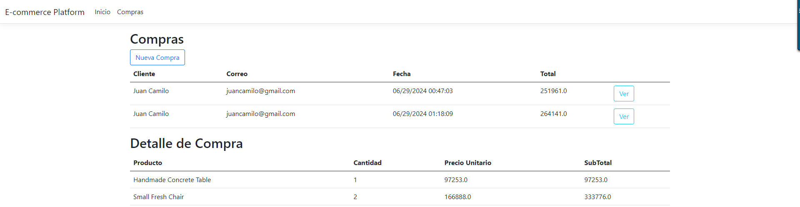
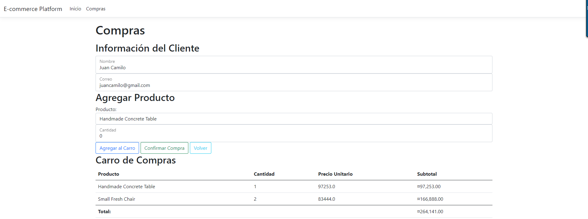
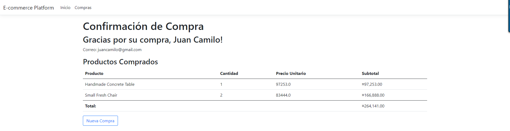
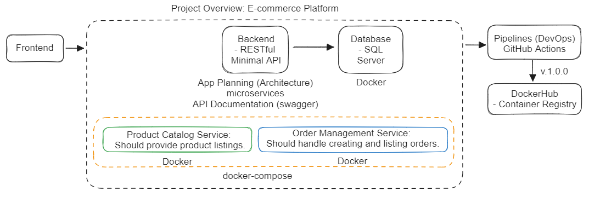
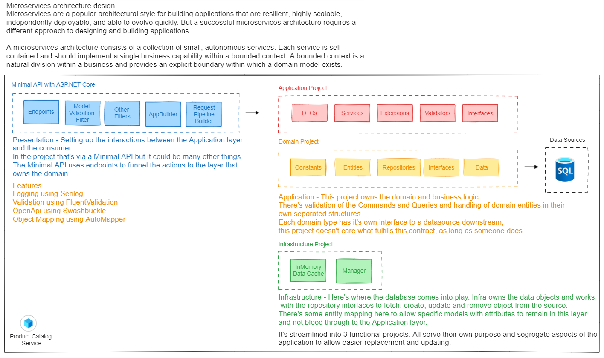
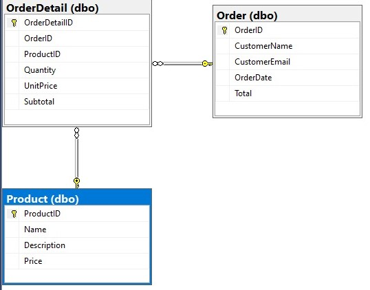

# Deployment of services (frontend and backends) in Docker of the E-commerce Platform
This repository contains the files and commands necessary to deploy the services (frontend and backends) in Docker of the E-commerce Platform

1. Clone this repository:
```shell
$ git clone https://github.com/juan0331camilo/Eccomerce.Platform
$ cd Eccomerce.Platform
```

2. Build the Docker image:
```shell
$ docker build -t ms-product-catalog -f Ecommerce.ProductCatalogMS.WebApi.Dockerfile .
$ docker build -t ms-order-management -f Ecommerce.OrderManagementMS.WebApi.Dockerfile .
$ docker build -t ecommerce-platform -f Ecommerce.Presentation.Dockerfile .
$ docker images
```

3. Run the Docker containers from the images:
```shell
$ docker run --name ecommerce-platform -d -p 3000:8080 \
-e PRODUCTS_SERVICE=http://host.docker.internal:3001 \
-e ORDERS_SERVICE=http://host.docker.internal:3002 \
-e ASPNETCORE_ENVIRONMENT=Development \
ecommerce-platform

$ docker run --name ms-product-catalog -d -p 3001:8080 \
-e ASPNETCORE_ENVIRONMENT=Development \
ms-product-catalog

$ docker run --name ms-order-management -d -p 3002:8080 \
-e ASPNETCORE_ENVIRONMENT=Development \
ms-order-management

$ docker ps
```

Note: You can also run containers from a Docker Compose:
```shell
$ docker-compose -p ecommerce-platform-fullstack --env-file .env.dev up -d --build
$ docker ps
```

4. Access the application http://localhost:3000  
  Access Login
  email: eve.holt@reqres.in
  password: cityslicka  

#Login Page

## Index Pages


## Cart Page


## Confirm Page


## Architecture


## A template for an API using Clean Architecture and .NET Minimal API's.


## ER Diagram and Relationships: A database schema that includes different types of relationships (e.g., one-to-one, one-to-many, many-to-many).


# Links
- Config repo: https://github.com/juan0331camilo/Eccomerce.Platform
- Docs E-commerce Platform repo: https://gist.github.com/AndresLinktic/3e26ea0c4786e81f80b316432687a583
- Docker repo: https://hub.docker.com/repository/docker/juancamilo0331
- Killercoda Interactive Environments: https://killercoda.com/